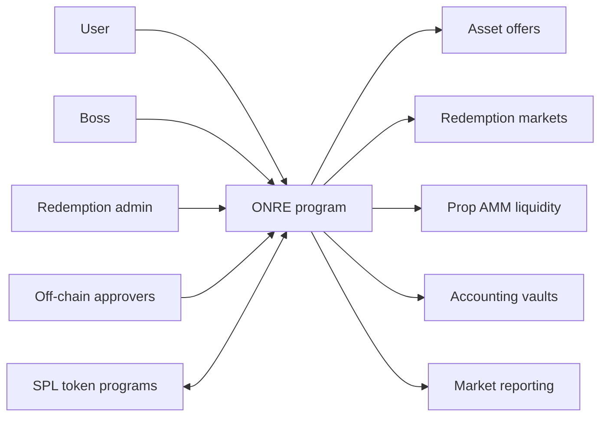
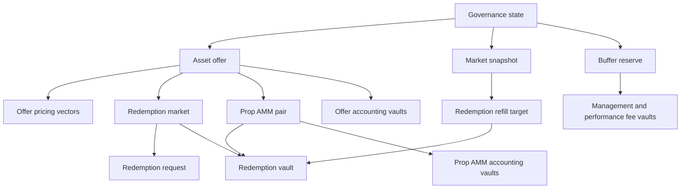
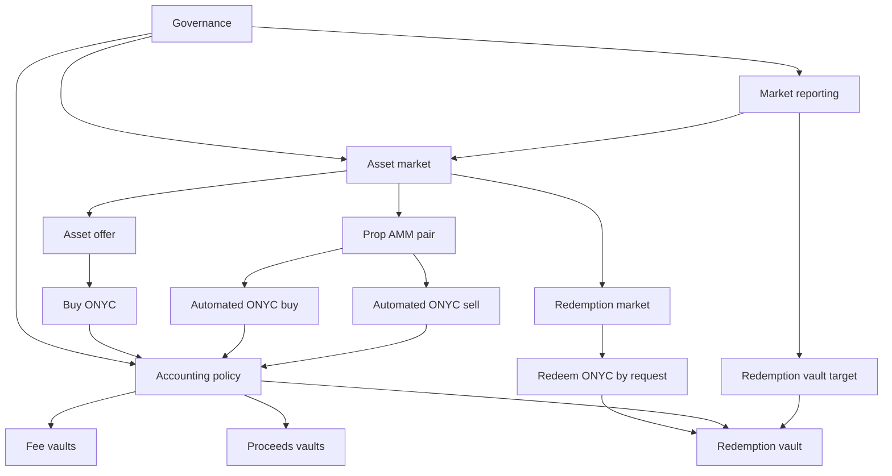
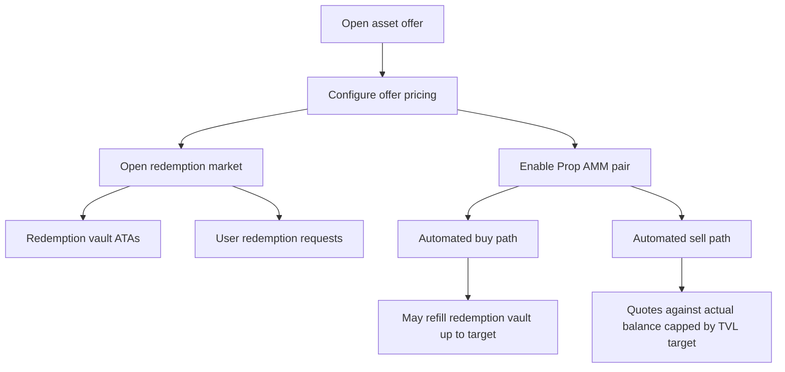
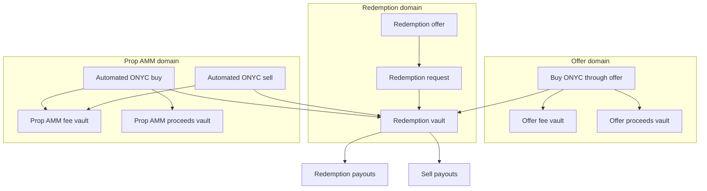
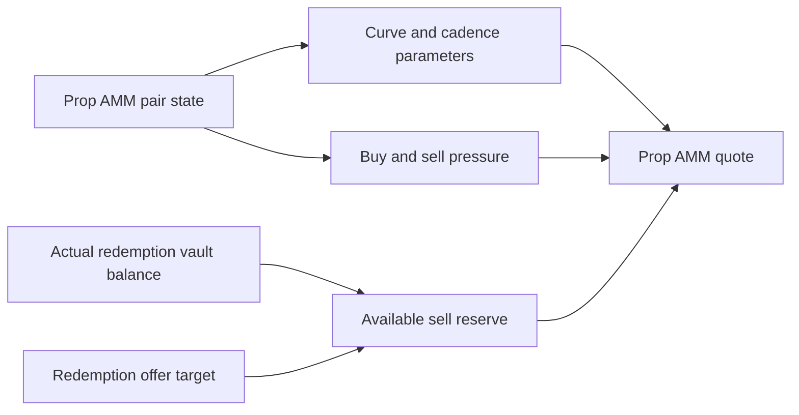
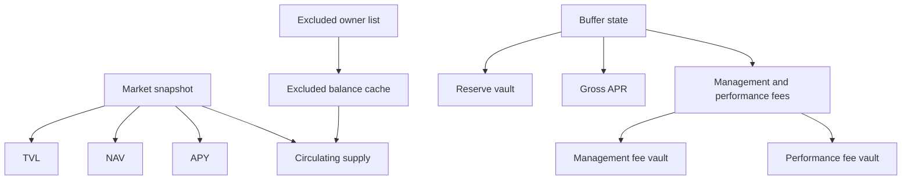
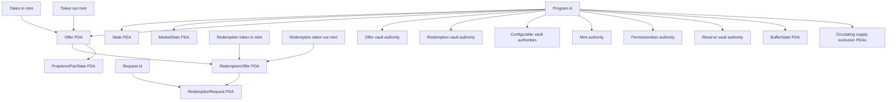

# Domain Model

This page explains the protocol objects in business terms first, then maps them to PDAs. It is meant for product, accounting, integration, and architecture discussions. Instruction-level token flow diagrams live in [`TOKEN_FLOW_ROUTING.md`](TOKEN_FLOW_ROUTING.md).

The structure follows two simple modeling rules:

- Keep the business model separate from implementation details such as PDA seeds.
- Use small diagrams with one purpose instead of one large diagram that mixes concepts, accounts, and transfers.

## Purpose

ONRE coordinates ONYC issuance, asset-backed offers, redemption liquidity, Prop AMM pricing, and accounting vault routing. The program does not treat these as one pool of money: offer activity, Prop AMM activity, fees, proceeds, redemption liquidity, and reserves are separate business domains.

## Liquidity And Reserve Strategy

Two modules exist to keep automated activity and reserve growth explicit instead
of hiding them inside ordinary offer or redemption balances:

- Prop AMM is the immediate-liquidity layer. It lets enabled markets quote and
  execute ONyc buys and sells automatically, while still routing assets through
  redemption liquidity, Prop AMM fee vaults, and Prop AMM proceeds vaults.
- BUFFER is the reserve-growth layer. It accrues configured reserve yield over
  time, splits reserve growth from management and performance fees, and stores a
  supply baseline so later ONyc mints and burns do not blur the accrual period.

Together, these modules separate three concerns that are easy to confuse:

- User liquidity: whether a user can buy or sell ONyc now.
- Redemption liquidity: how much asset balance is actually available for user
  payouts.
- Reserve accounting: how much ONyc growth belongs to reserve support or fees
  over time.

This separation is the reason Prop AMM and BUFFER use dedicated state and vaults
instead of reusing ordinary offer vaults.

## Domain Areas

| Area | What it owns |
| --- | --- |
| Governance and administration | Boss, admins, approvers, kill switch, targeted disables and mint caps. |
| Asset offers | Supported asset markets where users exchange an asset for ONYC. |
| Redemption markets | ONYC-to-asset redemption configuration, requests and fulfillment. |
| Prop AMM liquidity | Automated buy/sell pricing for configured asset markets. |
| Accounting vaults | Separate fee and proceeds buckets for offer and Prop AMM flows. |
| Market reporting | NAV, TVL, APY and circulating supply snapshots. |
| Buffer reserve | Separate reserve management and buffer accrual. |

## System Context



## Core Business Model



## Core Concepts

| Concept | Meaning |
| --- | --- |
| ONYC | Protocol token minted, burned, bought, sold and redeemed through configured markets. |
| Supported asset | External token accepted by an offer or paid out by a redemption market. |
| Asset offer | Primary market for exchanging a supported asset into ONYC. |
| Redemption market | Market for redeeming ONYC back into the supported asset. |
| Redemption request | User claim that locks ONYC until fulfillment or cancellation. |
| Prop AMM pair | Automated liquidity configuration attached to an asset offer. |
| Redemption vault | Actual token liquidity used by redemptions and Prop AMM sell payouts. |
| Accounting vault | Configurable destination for fees or proceeds by business source. |
| Market snapshot | Cached TVL, NAV, NAV adjustment, APY and circulating supply. |
| Buffer reserve | Separate reserve used by buffer operations. |

## Authority Model

| Role or authority | Business responsibility |
| --- | --- |
| Boss | Primary governance signer. Creates core configuration, manages admins and can disable emergency mode. |
| Admin | Can activate the kill switch for emergency response. |
| Redemption admin | Can create and manage redemption markets. |
| Approvers | Off-chain signers used by approval-gated offer execution. |
| Mint authority PDA | Program authority used when the program controls a mint. |
| Offer vault authority PDA | Program authority for regular offer vault token accounts. |
| Redemption vault authority PDA | Program authority for redemption vault token accounts. |
| Permissionless authority PDA | Intermediary authority used by permissionless offer execution. |
| Configurable vault PDA | Accounting vault authority with a boss-configured withdrawal destination. |

The distinction between a vault authority and a token account matters. The authority is the PDA that can sign. The vault balance is held in an associated token account for a specific mint under that authority.

## Business Relationship Map



## Market Lifecycle



## Value Domains



## Accounting Model

| Value bucket | Business source | Purpose |
| --- | --- | --- |
| Offer fee vault | Take-offer and redemption fulfillment fees | Fee accounting for regular offer and redemption activity. |
| Offer proceeds vault | Net offer inflow and non-burned redemption token-in not routed to redemption liquidity | Accounting destination for normal offer proceeds and redemption fulfillment proceeds. |
| Prop AMM fee vault | Prop AMM buy and sell fees | Fee accounting for Prop AMM activity. |
| Prop AMM proceeds vault | Net Prop AMM inflow not routed to redemption liquidity | Accounting destination for Prop AMM proceeds. |
| Redemption vault | Redemption requests, redemption payouts, and capped refill inflows | Liquidity pool used by redemption and Prop AMM sell paths. |
| Reserve vault | Buffer reserve | Reserve backing for buffer operations. |

## Vault Model

```mermaid
flowchart TD
    OfferVaultAuthority[Offer vault authority PDA] --> OfferTokenAccounts[Offer vault ATAs by mint]
    RedemptionVaultAuthority[Redemption vault authority PDA] --> RedemptionTokenAccounts[Redemption vault ATAs by mint]
    ReserveVaultAuthority[Reserve vault authority PDA] --> ReserveTokenAccount[Reserve ONYC ATA]

    OfferFeeVault[Offer fee vault PDA] --> OfferFeeTokenAccounts[Offer fee ATAs by mint]
    OfferProceedsVault[Offer proceeds vault PDA] --> OfferProceedsTokenAccounts[Offer proceeds ATAs by mint]
    PropAmmFeeVault[Prop AMM fee vault PDA] --> PropAmmFeeTokenAccounts[Prop AMM fee ATAs by mint]
    PropAmmProceedsVault[Prop AMM proceeds vault PDA] --> PropAmmProceedsTokenAccounts[Prop AMM proceeds ATAs by mint]
    ManagementFeeVault[Management fee vault PDA] --> ManagementFeeTokenAccounts[Management fee ATAs by mint]
    PerformanceFeeVault[Performance fee vault PDA] --> PerformanceFeeTokenAccounts[Performance fee ATAs by mint]
```



Business consequence:

- Vault authorities are program-derived signers.
- Token balances live in ATAs for a mint under the relevant authority.
- Offer vaults and redemption vaults hold operational liquidity.
- Configurable vaults hold accounting buckets and can redirect withdrawals through their configured destination.
- Management and performance fee vaults are configurable vaults used by buffer accrual.

## Redemption Vault Target

The redemption vault target belongs to the `RedemptionOffer`.

```text
target = TVL * vault_target_bps / 10_000
target_in_token_in_decimals = target * 10^token_in_decimals / 10^token_out_decimals
headroom = max(0, target_in_token_in_decimals - current_redemption_vault_balance)
refill = min(net_inflow, headroom)
overflow = net_inflow - refill
```

Business consequence:

- `vault_target_bps = 0` means no automatic refill; net inflow goes to proceeds.
- A positive target caps how much net asset inflow can refill the redemption vault.
- Fees are never part of the refill amount.
- Prop AMM sell pricing is always capped by the actual redemption vault balance. When `vault_target_bps > 0`, surplus balance above the TVL-derived target is ignored by the hard-wall curve.

## Prop AMM Pricing Boundary



The important boundary is:

- `PropAmmPairState` configures the curve.
- `RedemptionOffer.vault_target_bps` configures capped refill routing and, when nonzero, caps sell-side hard-wall reserve to the target percentage of TVL.
- The actual redemption vault token balance is still the sell-side solvency limit.

## Buffer And Market Reporting



The market snapshot is the shared reporting surface for TVL, NAV, NAV adjustment, APY and circulating supply. Circulating supply can exclude configured owners and uses a cached excluded balance. Buffer state tracks reserve accrual inputs, previous supply, fee configuration and the performance-fee high watermark.

## Operational Controls

| Control | Scope |
| --- | --- |
| Kill switch | Emergency stop for guarded value-moving paths. Admins or boss can enable it; only boss disables it. Governance and configuration-only instructions remain available under their normal authority checks. |
| Offer disabled flag | Targeted disable for one offer. |
| Redemption offer disabled flag | Targeted disable for one redemption market. |
| Prop AMM pair enabled flag | Enables or disables automated liquidity for one offer pair. |
| Max supply | Optional global ONYC supply cap. |
| Max mint amount | Optional cap on one logical ONYC mint operation. Buffer accrual applies it to the total gross accrual before splitting reserve and fee mints. |
| Fee limits | Offer and redemption fees are bounded by program limits. |
| Approval mode | Offer execution can require off-chain approval signatures. |
| Permissionless mode | Offer execution can be allowed through the permissionless authority path. |

## Primary Business Flows

| Flow | Business meaning |
| --- | --- |
| Offer setup | Governance opens an asset offer and configures pricing vectors. |
| Offer execution | User buys ONYC through an offer; fees and net inflow are routed separately. |
| Permissionless offer execution | Same economic result as offer execution, routed through the permissionless authority. |
| Redemption setup | Redemption admin or boss opens the ONYC-to-asset redemption market. |
| Redemption request | User locks ONYC into the redemption vault and receives a request claim. |
| Redemption fulfillment | Admin fulfills the request, charges fees, burns or routes ONYC, and pays the output asset. |
| Prop AMM buy | User buys ONYC through automated pricing; net asset inflow can refill redemption liquidity. |
| Prop AMM sell | User sells ONYC through automated pricing; output is bounded by actual redemption vault liquidity. |
| Buffer accrual | Buffer state mints reserve growth and splits management and performance fees. |
| Market refresh | Market statistics recompute TVL, NAV, NAV adjustment, APY and circulating supply. |

## Token Movement Rules

The program has two custody modes depending on mint authority:

- If the program controls the relevant mint, flows can mint or burn through the mint authority PDA.
- If the program does not control the mint, flows transfer from or to pre-funded vault token accounts.
- Fees route to fee vaults before net inflow routing.
- Net asset inflow can refill the redemption vault only up to the redemption market target; overflow goes to the relevant proceeds vault.

## Technical Mapping

The following maps the business concepts above to on-chain accounts. This is a technical reference; it is intentionally separated from the conceptual model.

### PDA Map



| PDA | Seeds | Notes |
| --- | --- | --- |
| `State` | `state` | Global governance and protocol configuration. |
| `MarketStats` | `market_stats` | Cached market metrics. |
| `Offer` | `offer`, `token_in_mint`, `token_out_mint` | Unique market for a token pair. |
| `RedemptionOffer` | `redemption_offer`, `token_in_mint`, `token_out_mint` | Redemption market, usually the reverse economic direction of an offer. |
| `RedemptionRequest` | `redemption_request`, `redemption_offer`, `request_id` | User claim against a redemption offer. |
| `PropAmmPairState` | `prop_amm_pair`, `offer` | Per-offer Prop AMM config and pressure state. |
| `ConfigurableVault` | `configurable_vault`, vault kind seed | Accounting vault authority with configurable withdrawal destination. |
| `OfferVaultAuthority` | `offer_vault_authority` | Authority for regular offer vault token accounts. |
| `RedemptionVaultAuthority` | `redemption_offer_vault_authority` | Authority for redemption vault token accounts. |
| `MintAuthority` | `mint_authority` | Program mint authority for controlled mints. |
| `PermissionlessAuthority` | `permissionless-1` | Intermediary authority for permissionless offer paths. |
| `BufferState` | `buffer_state` | Buffer accrual and reserve configuration. |
| `ReserveVaultAuthority` | `reserve_vault_authority` | Authority for the buffer reserve vault. |
| `CirculatingSupplyExcludedAccounts` | `circ_supply_excl_accounts` | Owner list excluded from circulating supply. |
| `CirculatingSupplyExcludedBalance` | `circ_supply_excl_balance` | Cached excluded ONYC balance. |

### Configurable Vault Kinds

| Kind | Seed suffix | Business bucket |
| --- | --- | --- |
| `OfferFee` | `offer_fee` | Regular offer and redemption fulfillment fees. |
| `OfferProceeds` | `offer_proceeds` | Regular offer net proceeds. |
| `PropAmmFee` | `prop_amm_fee` | Prop AMM fees. |
| `PropAmmProceeds` | `prop_amm_proceeds` | Prop AMM net proceeds. |
| `ManagementFee` | `management_fee` | Buffer management fees. |
| `PerformanceFee` | `performance_fee` | Buffer performance fees. |

## Rules To Keep Straight

- Offer markets, redemption markets, Prop AMM settings, and accounting vaults are separate concepts.
- A redemption offer is the redemption market linked to an offer.
- Offer and Prop AMM accounting are separated into different fee and proceeds vaults.
- The redemption vault target controls capped refill routing and can cap Prop AMM sell-side effective liquidity.
- Prop AMM sell quotes cannot price against more than actual redemption vault liquidity; configured targets only reduce available curve liquidity.
