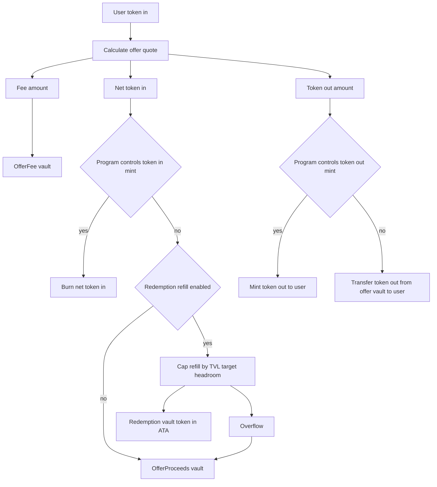
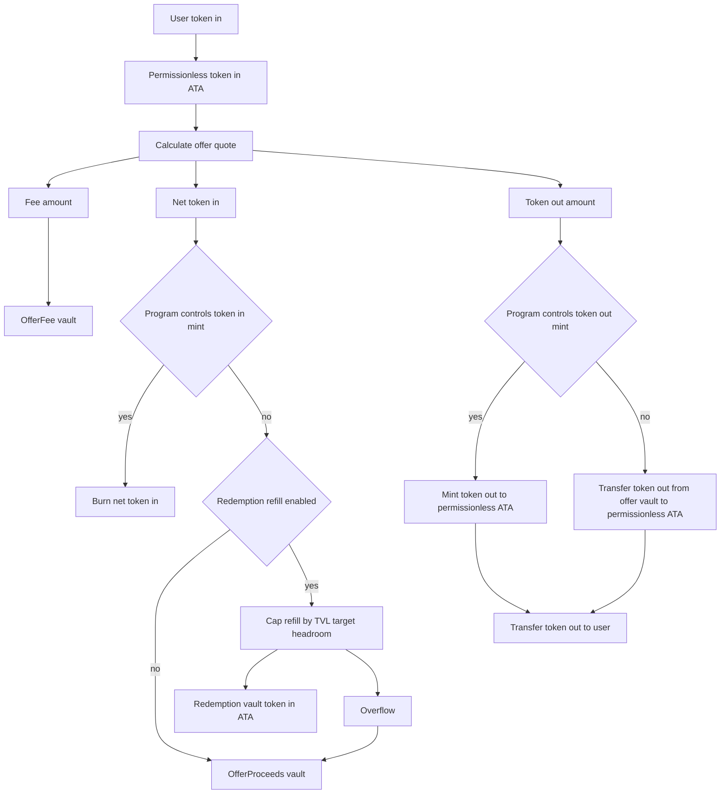
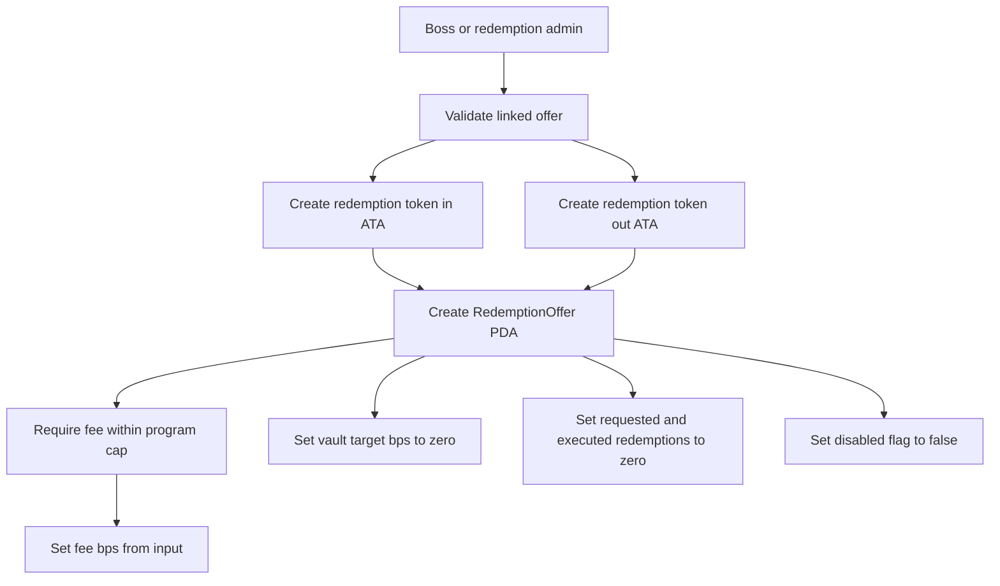
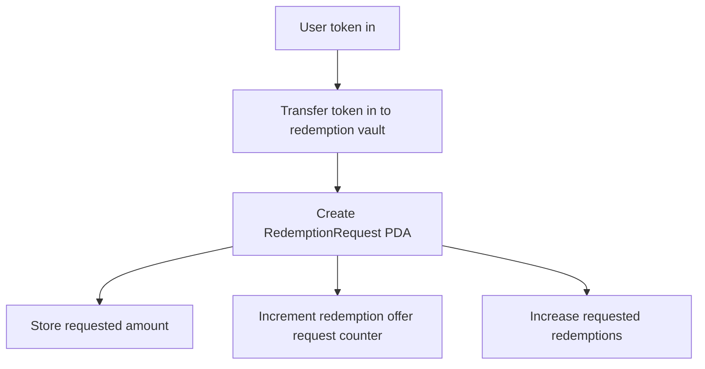
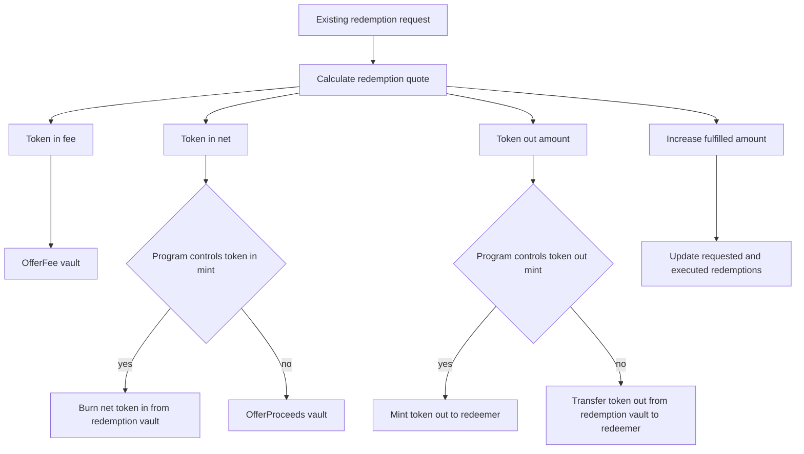
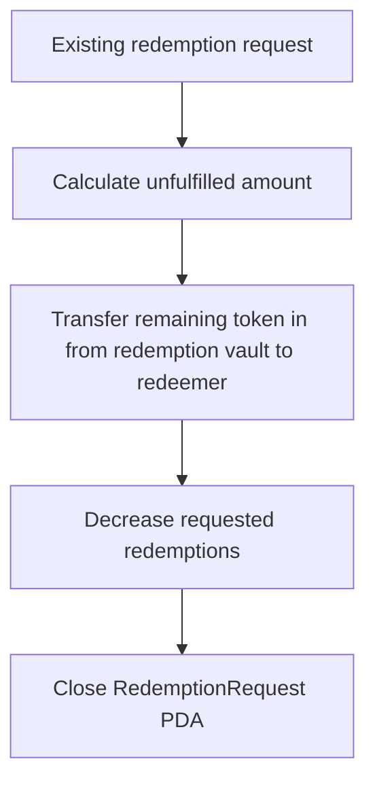
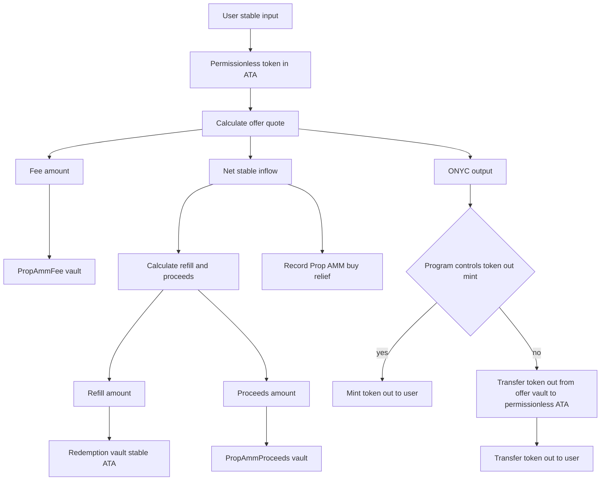
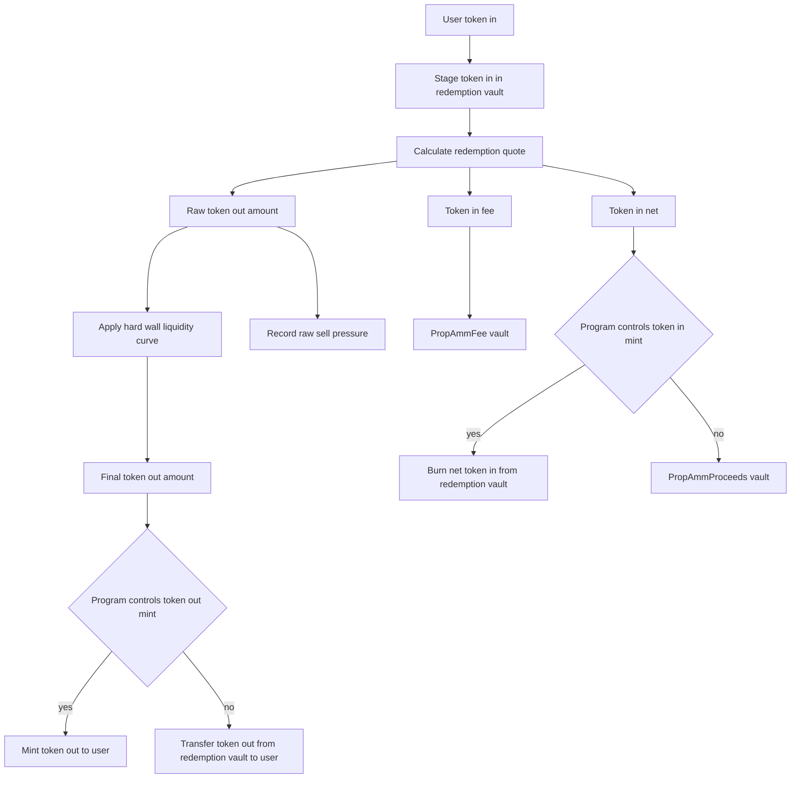

# Token Flow Routing

This page shows where tokens move for the main V2 offer, redemption, and Prop AMM flows. It focuses on accounting destinations: fee vaults, proceeds vaults, redemption vault liquidity, burns, mints, and user payouts.

Legacy `take_offer` and legacy `take_offer_permissionless` do not use the redemption-vault refill routing described here.

## Shared Refill Rule

Net stable inflow from `take_offer_v2`, `take_offer_permissionless_v2`, and Prop AMM buy can refill the redemption vault only when both conditions are true:

- a matching `RedemptionOffer` exists
- `RedemptionOffer.vault_target_bps > 0`

For `take_offer_v2` and `take_offer_permissionless_v2`, refill also requires that the program does not control the token-in mint. If the program controls token-in, net token-in is burned and refill is forced to zero. Prop AMM buy calculates refill directly from the target and current redemption vault balance.

The cap is:

```text
target = TVL * vault_target_bps / 10_000
target_in_token_in_decimals = target * 10^token_in_decimals / 10^token_out_decimals
headroom = max(0, target_in_token_in_decimals - current_redemption_vault_balance)
refill = min(net_stable_inflow, headroom)
proceeds = net_stable_inflow - refill
```

If `MarketStats` cannot be read, the target calculation resolves to zero. Fees are never part of the refill amount. Fees route to the fee vault for the same business source.

Protocol fees use ceiling rounding. Token-2022 mints with transfer fees are rejected before token operations.

## `take_offer_v2`



Notes:

- Refill uses net token-in only.
- `OfferFee` receives the fee regardless of whether net token-in is burned, refilled, or sent to proceeds.
- If token out is ONYC and the buffer is initialized, buffer accrual can run before minting and market stats can refresh after execution.

## `take_offer_permissionless_v2`



Notes:

- The permissionless authority is an intermediary signer. The economic routing matches `take_offer_v2`.
- Refill is skipped if no refill accounts are supplied, no matching redemption offer exists, the target is zero, or token-in is program-controlled.

## Redemption Offer Creation



Notes:

- The redemption market is the ONYC-to-asset side linked to the offer.
- Initial `vault_target_bps` is zero, so new redemption markets do not automatically receive refill inflow until configured.
- Redemption offer creation rejects fee values above the program fee cap.

## Redemption Request Creation



Notes:

- The request locks token-in in the redemption vault.
- Fulfillment can be partial; the request tracks fulfilled amount.

## Redemption Fulfillment



Notes:

- Fees are paid in token-in from the locked redemption-vault balance.
- If token-in is program-controlled, net token-in is burned.
- If token-in is not program-controlled, net token-in moves to `OfferProceeds`.
- If the fulfillment completes the request, the request account closes.

## Redemption Request Cancellation



Notes:

- The redeemer, redemption admin, or boss can cancel.
- Only the unfulfilled remainder is returned.

## Prop AMM Buy



Notes:

- Prop AMM buy uses `PropAmmFee` and `PropAmmProceeds`, not the offer accounting vaults.
- Buy pressure relief records the full net stable inflow, independent of how much was refilled.
- Refill is capped by the redemption market target. Overflow goes to `PropAmmProceeds`.

## Prop AMM Sell



Notes:

- Prop AMM sell uses `PropAmmFee` and `PropAmmProceeds`.
- User token-in is first staged in the redemption vault; for ONYC sells, the net amount is burned from there.
- The hard wall prices against the actual redemption vault token-out balance.
- `vault_target_bps` is not a Prop AMM sell quote input.
- Sell pressure records the raw stable output before the hard-wall liquidity factor, not the final paid amount.
