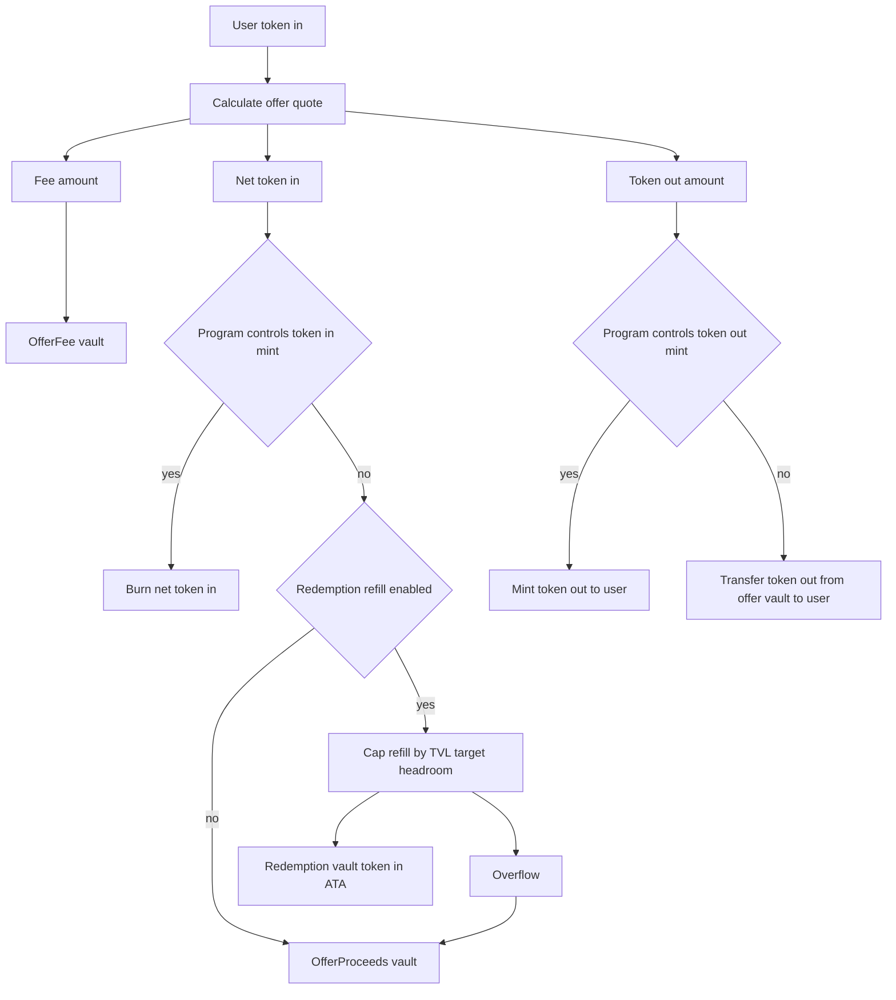
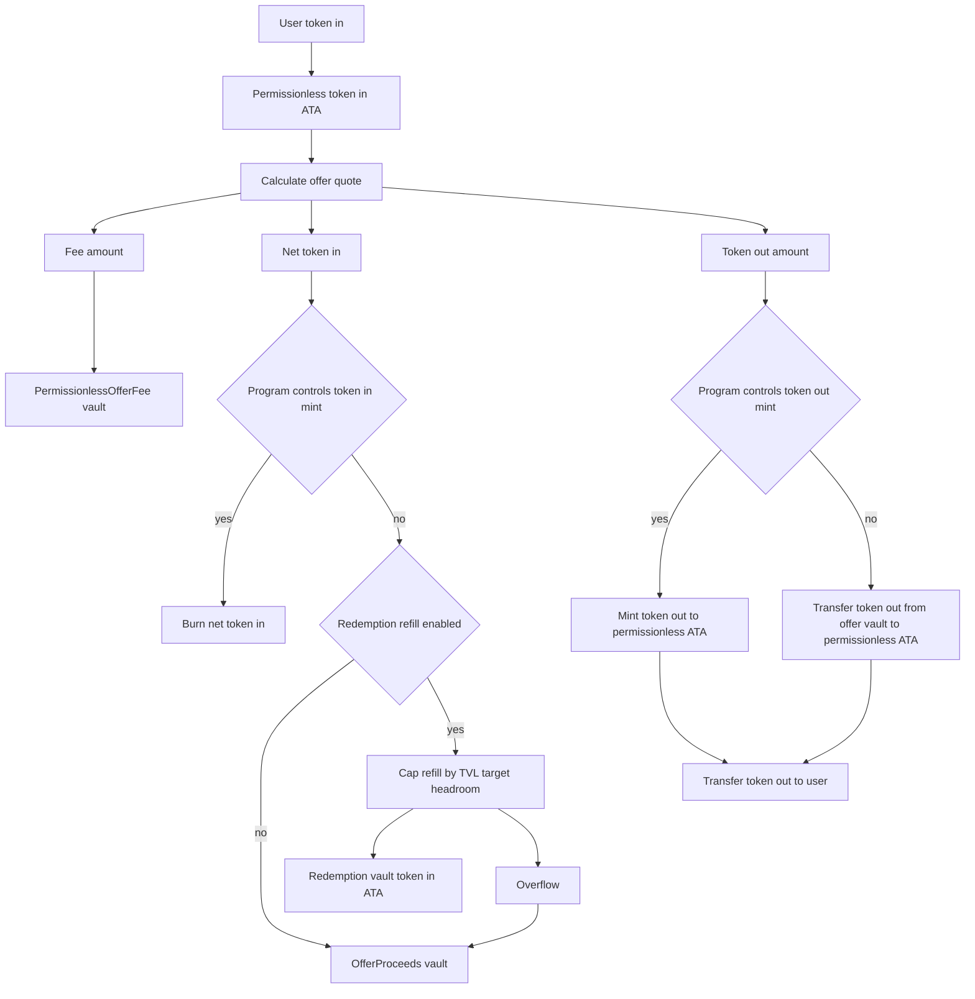
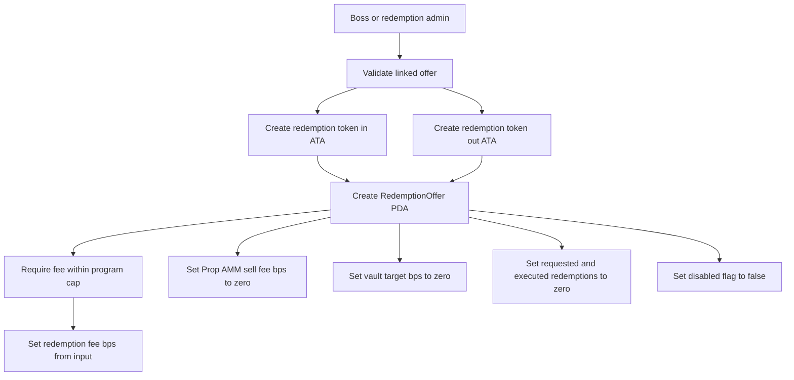
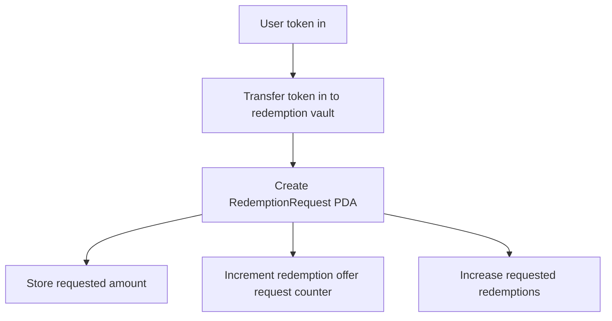
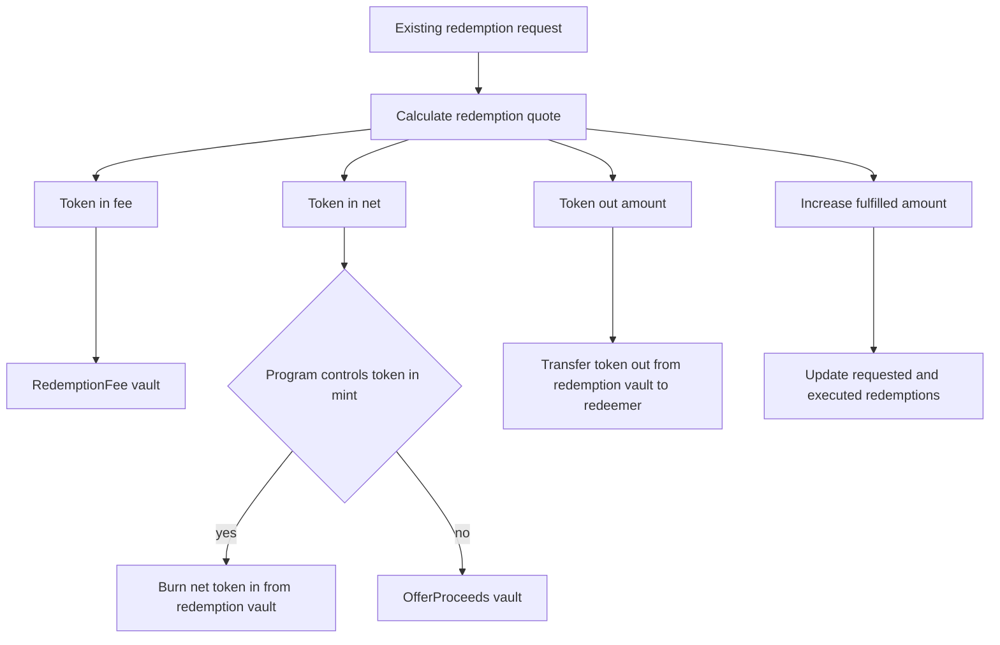
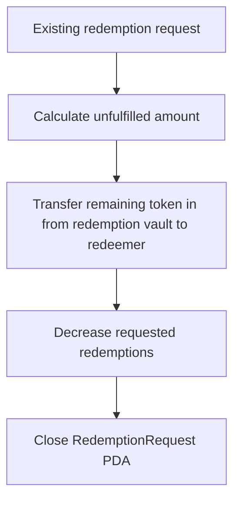
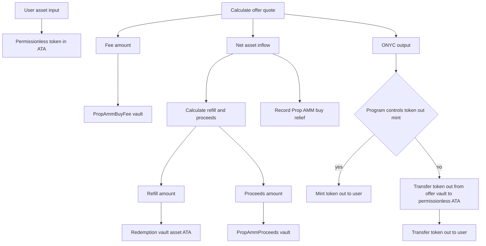
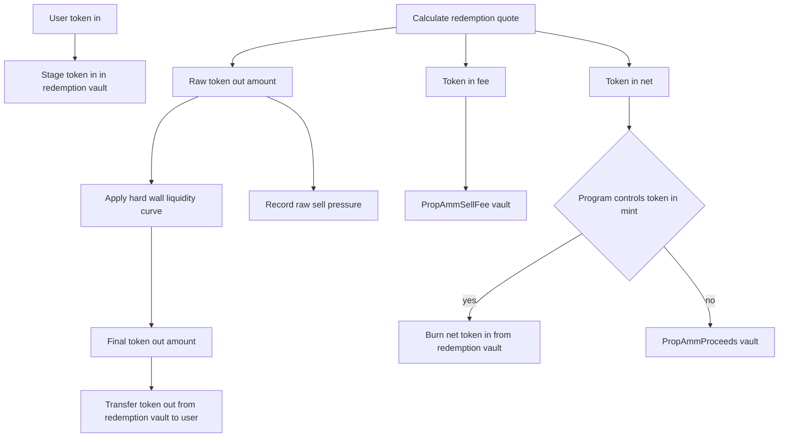

# Token Flow Routing

This page shows where tokens move for the main V2 offer, redemption, and Prop AMM flows. It focuses on accounting destinations: fee vaults, proceeds vaults, redemption vault liquidity, burns, mints, and user payouts.

Legacy `take_offer` and legacy `take_offer_permissionless` do not use configurable accounting vaults or redemption-vault refill routing. If the program controls the token-in mint, net token-in is burned and fee token-in routes to the boss token-in ATA; otherwise both net token-in and fee token-in route to the boss token-in ATA.

## Kill Switch

Token-moving instructions on this page are guarded by `state.is_killed`. When the kill switch is enabled, offer takes, Prop AMM quotes/execution, redemption request create/fulfill/cancel, vault deposits/withdrawals, reserve vault movement, configurable-vault withdrawals, direct `mint_to`, `burn_for_nav_increase`, and BUFFER config updates that settle accrual reject before moving, minting, or burning tokens.

The kill switch is not a global pause for every instruction. Governance and configuration-only instructions remain available under their normal authority checks.

## Shared Refill Rule

Net asset inflow from `take_offer_v2`, `take_offer_permissionless_v2`, and Prop AMM buy can refill the redemption vault only when all conditions are true:

- a matching `RedemptionOffer` exists
- the matching `RedemptionOffer` is initialized and enabled
- `RedemptionOffer.vault_target_bps > 0`

For `take_offer_v2` and `take_offer_permissionless_v2`, refill also requires that the program does not control the token-in mint. If the program controls token-in, net token-in is burned and refill is forced to zero. Prop AMM buy calculates refill directly from the target and current redemption vault balance.

The cap is:

```text
target = TVL * vault_target_bps / 10_000
target_in_token_in_decimals = target * 10^token_in_decimals / 10^token_out_decimals
headroom = max(0, target_in_token_in_decimals - current_redemption_vault_balance)
refill = min(net_asset_inflow, headroom)
proceeds = net_asset_inflow - refill
```

If `MarketStats` cannot be read, the target calculation resolves to zero. Fees are never part of the refill amount. Fees route to the fee vault for the same business source.

Protocol fees use ceiling rounding. Token-2022 mints with transfer fees are rejected inside the token-operation helpers; failed transactions roll back staged transfers.

## `take_offer_v2`



Notes:

- Refill uses net token-in only.
- `OfferFee` receives the fee regardless of whether net token-in is burned, refilled, or sent to proceeds.
- If token out is ONYC, the buffer is initialized, and the program controls the ONYC mint, buffer accrual can run before minting. Market stats can refresh after execution whenever token out is ONYC.

## `take_offer_permissionless_v2`



Notes:

- `take_offer_permissionless_v2` uses `fee_basis_points_permissionless`, which defaults to `0` for newly created and upgraded offers until the boss calls `update_offer_permissionless_fee`.
- The permissionless authority is an intermediary signer. V2 permissionless fees route to `PermissionlessOfferFee`; net token-in otherwise follows the same burn, refill, and proceeds rules as `take_offer_v2`.
- Refill is skipped if the supplied redemption offer account is uninitialized or disabled, the target is zero, `MarketStats` cannot be read, or token-in is program-controlled.

## Redemption Offer Creation



Notes:

- The redemption market is the ONYC-to-asset side linked to the offer.
- Initial `vault_target_bps` is zero, so new redemption markets do not automatically receive refill inflow until configured.
- Redemption offer creation rejects fee values above the program fee cap.
- `fee_basis_points` is the redemption admin fulfillment fee. `fee_basis_points_prop_amm_sell` is the Prop AMM sell redemption fee set at redemption offer creation and later adjustable by the boss through `update_redemption_offer_prop_amm_sell_fee`.

## Redemption Request Creation



Notes:

- The request locks token-in in the redemption vault.
- Fulfillment can be partial; the request tracks fulfilled amount.

## Redemption Fulfillment



Notes:

- Fees are paid in token-in from the locked redemption-vault balance and route to `RedemptionFee`.
- If token-in is program-controlled, net token-in is burned.
- If token-in is not program-controlled, net token-in moves to `OfferProceeds`.
- Token-out is paid from pre-funded redemption-vault liquidity; redemption fulfillment does not mint token-out.
- If the fulfillment completes the request, the request account closes.

## Redemption Request Cancellation



Notes:

- The redeemer, redemption admin, or boss can cancel.
- Only the unfulfilled remainder is returned.

## Prop AMM Buy



Notes:

- Prop AMM buy uses the offer's `fee_basis_points_permissionless` for fee calculation and routes that fee to `PropAmmBuyFee`. Net inflow routes to `PropAmmProceeds` or redemption-vault refill.
- Prop AMM buy execution requires the offer's permissionless mode to be enabled. A quote can exist even when execution would reject this gate.
- Buy pressure relief records the full net asset inflow, independent of how much was refilled.
- Refill is capped by the redemption market target. Overflow goes to `PropAmmProceeds`.

## Prop AMM Sell



Notes:

- Prop AMM sell uses `RedemptionOffer.fee_basis_points_prop_amm_sell` for its percentage redemption fee and routes fees to `PropAmmSellFee`. Net token-in routes to `PropAmmProceeds` or burns, depending on mint authority.
- Sell execution calculates the quote and checks `minimum_out` before staging user token-in in the redemption vault. If the program controls the token-in mint, the net amount is burned from the redemption vault; otherwise it routes to `PropAmmProceeds`.
- Sell execution pays token-out from pre-funded redemption-vault liquidity; it does not mint token-out.
- Sell execution refreshes `MarketStats` before resolving the hard-wall reserve. Quote and execution read TVL for hard-wall reserve only when `vault_target_bps > 0`; when `vault_target_bps == 0`, the hard-wall reserve resolves to the actual vault balance without reading TVL.
- If sell execution later accrues BUFFER before burning ONYC, the hard-wall reserve is not recomputed again after that accrual.
- The hard wall is always bounded by the actual redemption vault token-out balance.
- When `vault_target_bps > 0`, the hard-wall reserve is additionally capped by `TVL * vault_target_bps / 10_000`, converted into token-out decimals. In code: `hard_wall_reserve = min(actual_vault_balance, target_from_tvl)`.
- When `vault_target_bps == 0`, the hard-wall reserve is the actual redemption vault token-out balance.
- Sell pressure records the raw pair-asset output before the hard-wall liquidity factor, not the final paid amount.
